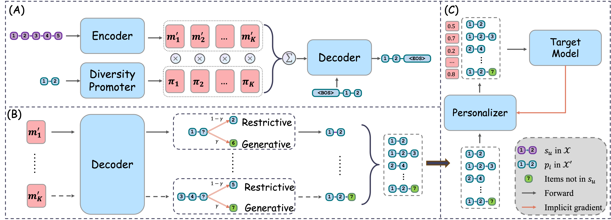
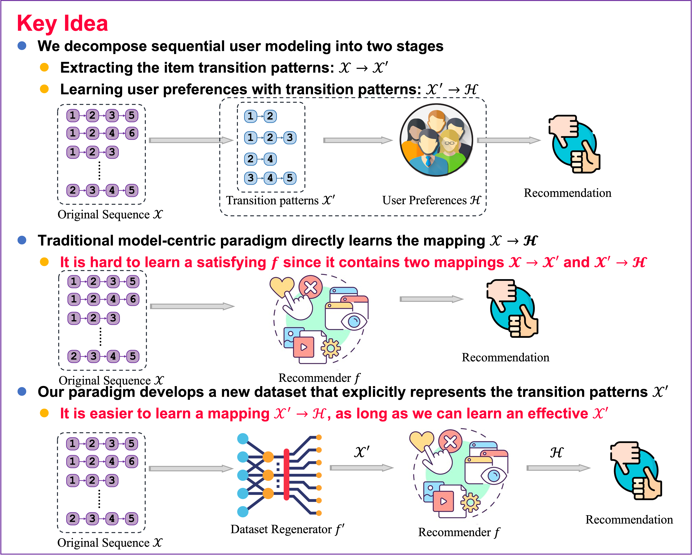

# Dataset Regeneration for Sequential Recommendation

## Framework overview of DR4SR & DR4SR+



## Key idea of our work



## Quickstart

### Requirements

> The exact version used for the paper. Upgraded versions should also be applicable.

- python == 3.9.19
- torch == 1.13.1+cu117
- seq2pat == 1.4.0
- numpy == 1.26.4
- scipy == 1.12.0

You can install these required packages by 

```bash
conda create -n DR4SR python=3.9
conda activate DR4SR
pip install -r requirements.txt
```

### Dataset preprocessing

> We have uploaded the preprocessed datasets in `dataset/`. You can reproduced these preprocessed datasets with the following steps.

1. Download the used [Amazon](http://snap.stanford.edu/data/amazon/productGraph/categoryFiles/) and [Yelp](https://github.com/salesforce/ICLRec) datasets and put them in `dataset/`.

2. Preprocess these datasets with scripts in `dataset/`
  - Amazon: `dataset/preprocess_amazon.ipynb`
  - Yelp: `dataset/preprocess_yelp.ipynb`

### Model-agnostic dataset regeneration

```bash
# 0. Select a target dataset, e.g., Amazon-toys
DATASET=amazon-toys
DATA_ALIAS=toy
ROOT_PATH=./dataset/${DATASET}/${DATA_ALIAS}/

# 1. Build the pre-training dataset.
python 1.Build_pretraining_dataset.py --root_path $ROOT_PATH

# 2. Generate pre-trained item embeddings.
python run.py --model SASRec --dataset $DATASET

# 3. Move the corresponding ckpt file to the dataset folder, and rename it to pre-trained_embedding.ckpt.
mv CKPT_FILE_PATH ${ROOT_PATH}/pre-trained_embedding.ckpt

# 4. Pre-train the data regenerator.
python 2.Pretrain_regenerator.py --root_path $ROOT_PATH --K 5

# 5. Obtain regenerated dataset with hybrid inference.
# Note: This process can be greatly accelerated with multi-processing. 
# We will provide a clean implementation of multi-processing in the future.
python 3.Hybrid_inference --root_path $ROOT_PATH

# 6. (Optional) Transform datasets for FMLP with dataset/dataset_transform.ipynb


# 7. (DR4SR) Train a target model on regenerated dataset
# (Note 1)Please set the `train_file` option to '_regen' in the corresponding config file `configs/amazon-toys.yaml`.
# (Note 2) You can test the original dataset by setting `train_file` option to '_ori'
python run.py -m SASRec -d amazon-toys

# 8. (DR4SR+) Train a target model on regenerated and personalized dataset. We should first change 'sub_model' option to one of the target models in `configs/metamodel.yaml`
python run.py -m MetaModel -d amazon-toys
```

> Note: We use post padding ([1,2,3] -> [1,2,3,0,0]) for all target models except FMLP. And we use pre padding for FMLP ([1,2,3] -> [0,0,1,2,3]), which is consistent with the original implementation of FMLP. This is because we find the previous pre-processing will lead to terrible results of FMLP. This may be related to property of the FFT operation. Therefore, we should run `dataset/dataset_transform.ipynb` to transform all datasets for FMLP.

## Resources

1. [Poster](./assets/KDD2024_poster.pdf) presented in KDD2024.
2. [Slides](./assets/presentation.pdf) presented in KDD2024.

## Citation

If you find DR4SR useful, please cite it as:
```bibtex
@inproceedings{yin2024dataset,
  title={Dataset Regeneration for Sequential Recommendation},
  author={Yin, Mingjia and Wang, Hao and Guo, Wei and Liu, Yong and Zhang, Suojuan and Zhao, Sirui and Lian, Defu and Chen, Enhong},
  booktitle={Proceedings of the 30th ACM SIGKDD Conference on Knowledge Discovery and Data Mining},
  pages={3954--3965},
  year={2024}
}
```

## Acknowledgments

This project is primarily built upon the foundation provided by [RecStudio](https://github.com/ustcml/RecStudio), which is a unified, highly-modularized and recommendation-efficient recommendation library based on PyTorch. The creation of the pre-training dataset for data regeneration relies on the capabilities of [Seq2Pat](https://github.com/fidelity/seq2pat). The implicit gradient optimization framework is modified from [AuxiLearn](https://github.com/AvivNavon/AuxiLearn). We extend our gratitude to the developers of these outstanding repositories for their dedicated efforts and contributions.