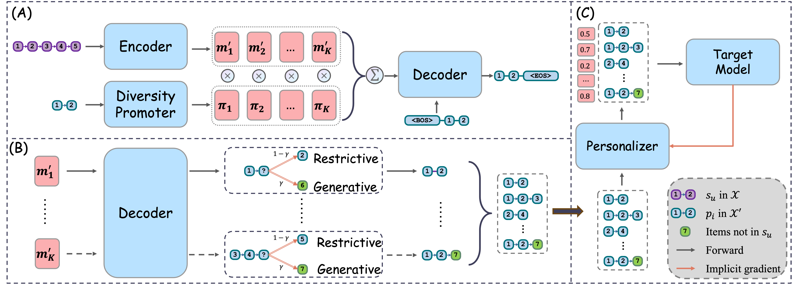
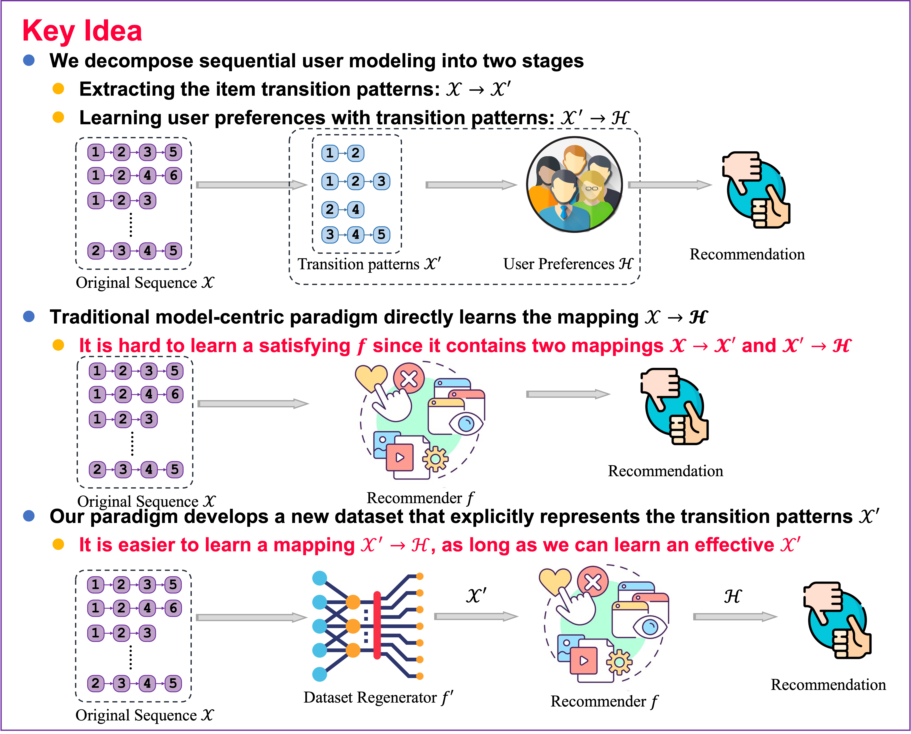

# DR4SR

Official implementation for **Dataset Regeneration for Sequential Recommendation**.

[](https://doi.org/10.1145/3637528.3671841)
[](https://arxiv.org/abs/2405.17795)
[](https://kdd2024.kdd.org/)
[](https://ustc-starteam.github.io/DR4SR/)

## 1. Paper

Mingjia Yin, Hao Wang, Wei Guo, Yong Liu, Suojuan Zhang, Sirui Zhao, Defu Lian, and Enhong Chen. **Dataset Regeneration for Sequential Recommendation**. In *Proceedings of the 30th ACM SIGKDD Conference on Knowledge Discovery and Data Mining (KDD 2024)*, pages 3954-3965, Barcelona, Spain, 2024.

[Paper](https://doi.org/10.1145/3637528.3671841) / [arXiv](https://arxiv.org/abs/2405.17795) / [PDF](https://arxiv.org/pdf/2405.17795) / [Project Page](https://ustc-starteam.github.io/DR4SR/) / [Poster](assets/KDD2024_poster.pdf) / [Slides](assets/presentation.pdf) / [Citation](#12-citation)

DR4SR introduces a data-centric view for sequential recommendation: instead of only designing stronger models for fixed data, it regenerates training datasets to improve the quality of sequential signals. The paper received the KDD 2024 Best Student Paper award.

## 2. Highlights

- Proposes dataset regeneration for sequential recommendation.
- Supports both DR4SR and DR4SR+ training flows.
- Provides preprocessed datasets under `dataset/`.
- Includes the KDD 2024 poster and presentation slides.
- Builds on RecStudio, Seq2Pat, and AuxiLearn components.

## 3. Method At A Glance



DR4SR builds a pre-training dataset, learns item embeddings, pre-trains a data regenerator, obtains regenerated sequences through hybrid inference, and trains downstream sequential recommendation models on regenerated data.

## 4. Repository Structure

```text
.
├── 1.Build_pretraining_dataset.py
├── 2.Pretrain_regenerator.py
├── 3.Hybrid_inference.py
├── run.py
├── configs/                 # Model and dataset configs
├── dataset/                 # Preprocessed datasets and preprocessing notebooks
├── model/                   # Sequential recommendation models
├── assets/                  # Framework, poster, and slides
└── docs/                    # GitHub Pages project page
```

## 5. Installation

The paper used:

```text
python == 3.9.19
torch == 1.13.1+cu117
seq2pat == 1.4.0
numpy == 1.26.4
scipy == 1.12.0
```

Install with:

```bash
conda create -n DR4SR python=3.9
conda activate DR4SR
pip install -r requirements.txt
```

## 6. Data

Preprocessed datasets are uploaded under `dataset/`. To reproduce preprocessing:

1. Download [Amazon](http://snap.stanford.edu/data/amazon/productGraph/categoryFiles/) and [Yelp](https://github.com/salesforce/ICLRec) datasets and place them under `dataset/`.
2. Run the preprocessing notebooks:
   - Amazon: `dataset/preprocess_amazon.ipynb`
   - Yelp: `dataset/preprocess_yelp.ipynb`

## 7. Quick Start

Model-agnostic dataset regeneration:

```bash
# 0. Select a target dataset, e.g., Amazon-toys.
DATASET=amazon-toys
DATA_ALIAS=toy
ROOT_PATH=./dataset/${DATASET}/${DATA_ALIAS}/

# 1. Build the pre-training dataset.
python 1.Build_pretraining_dataset.py --root_path $ROOT_PATH

# 2. Generate pre-trained item embeddings.
python run.py --model SASRec --dataset $DATASET

# 3. Move the corresponding checkpoint to the dataset folder.
mv CKPT_FILE_PATH ${ROOT_PATH}/pre-trained_embedding.ckpt

# 4. Pre-train the data regenerator.
python 2.Pretrain_regenerator.py --root_path $ROOT_PATH --K 5

# 5. Obtain regenerated dataset with hybrid inference.
python 3.Hybrid_inference.py --root_path $ROOT_PATH

# 6. Optional: transform datasets for FMLP with dataset/dataset_transform.ipynb.

# 7. DR4SR: train a target model on regenerated data.
# Set train_file to '_regen' in configs/amazon-toys.yaml.
python run.py -m SASRec -d amazon-toys

# 8. DR4SR+: train a target model on regenerated and personalized data.
# Set sub_model in configs/metamodel.yaml.
python run.py -m MetaModel -d amazon-toys
```

## 8. Reproducing Results

For original datasets, set `train_file` to `_ori`. For regenerated datasets, set `train_file` to `_regen` in the corresponding dataset config.

FMLP uses pre-padding, while other target models use post-padding. Run `dataset/dataset_transform.ipynb` before using FMLP, which follows the original FMLP implementation convention.

## 9. Configuration Notes

- Dataset configs: `configs/amazon-toys.yaml`, `configs/amazon-sport.yaml`, `configs/amazon-beauty.yaml`, and `configs/yelp.yaml`.
- Target model configs: `configs/sasrec.yaml`, `configs/gru4rec.yaml`, `configs/fmlp.yaml`, `configs/gnn.yaml`, and `configs/metamodel.yaml`.
- Regenerator checkpoint expected path: `${ROOT_PATH}/pre-trained_embedding.ckpt`.

## 10. Experimental Highlights



The paper shows that improving training data can complement model-centric improvements in sequential recommendation. DR4SR and DR4SR+ evaluate this idea across multiple datasets and target models.

## 11. Notes For Maintainers

- Keep poster and slides available under `assets/` because they are linked from the paper section.
- Preserve the numbered scripts; the README quick start follows their execution order.
- If a multiprocessing version of hybrid inference is added, document it next to step 5.

## 12. Citation

If you find DR4SR useful, please cite:

```bibtex
@inproceedings{yin2024dataset,
  title={Dataset Regeneration for Sequential Recommendation},
  author={Yin, Mingjia and Wang, Hao and Guo, Wei and Liu, Yong and Zhang, Suojuan and Zhao, Sirui and Lian, Defu and Chen, Enhong},
  booktitle={Proceedings of the 30th ACM SIGKDD Conference on Knowledge Discovery and Data Mining},
  pages={3954--3965},
  year={2024},
  doi={10.1145/3637528.3671841}
}
```

## 13. Contact

- First author: Mingjia Yin.
- Repository questions: please open a GitHub issue in this repository.

## 14. Acknowledgments

This project is primarily built upon [RecStudio](https://github.com/ustcml/RecStudio). The pre-training dataset construction relies on [Seq2Pat](https://github.com/fidelity/seq2pat). The implicit gradient optimization framework is modified from [AuxiLearn](https://github.com/AvivNavon/AuxiLearn). We thank the developers of these repositories for their contributions.
